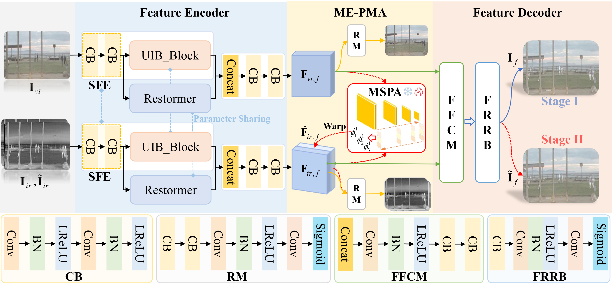
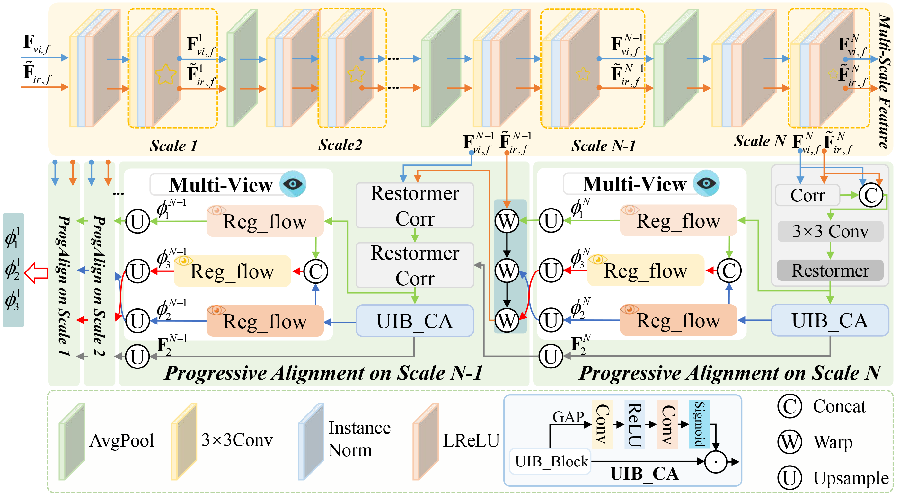
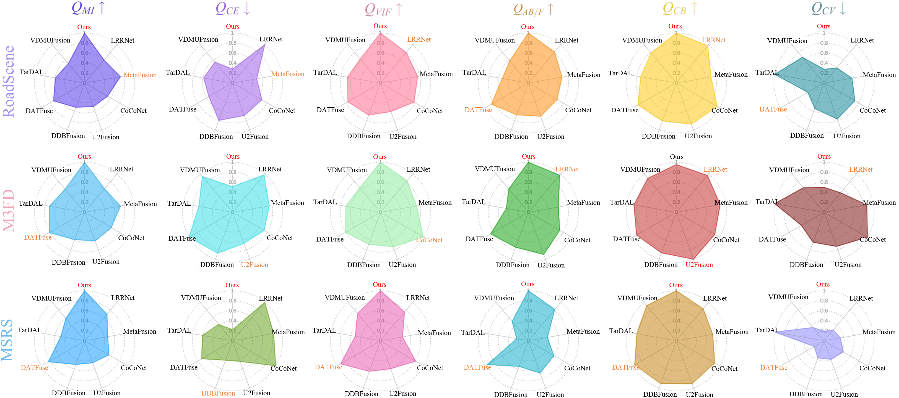
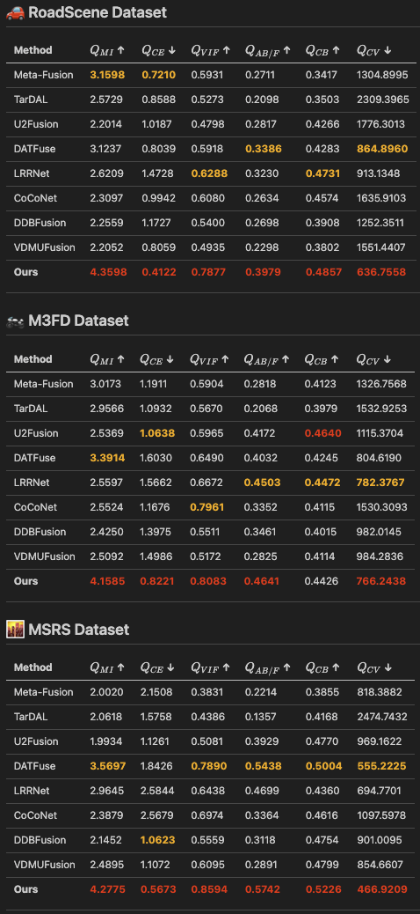
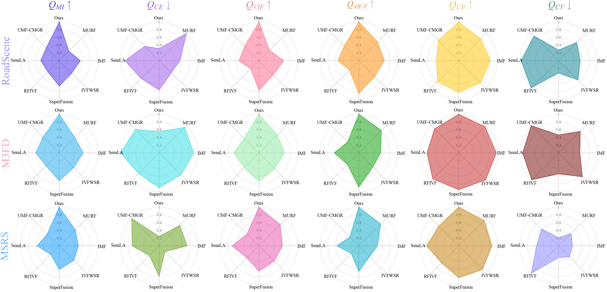
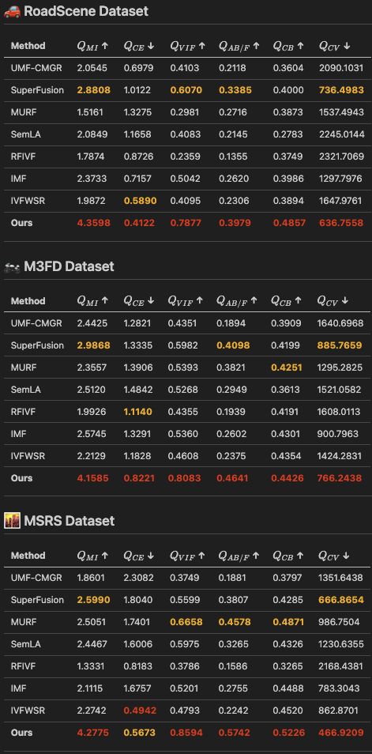
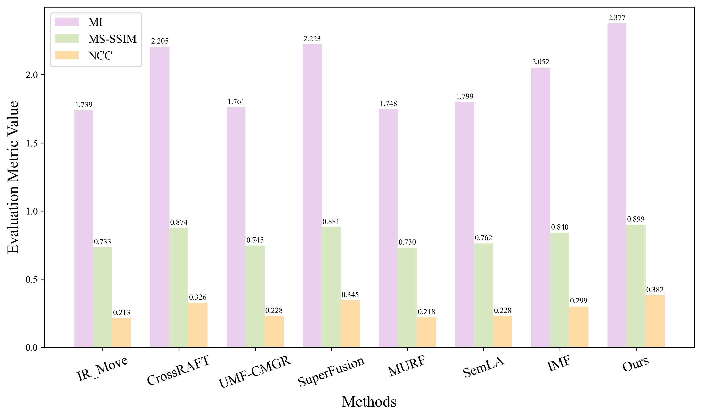
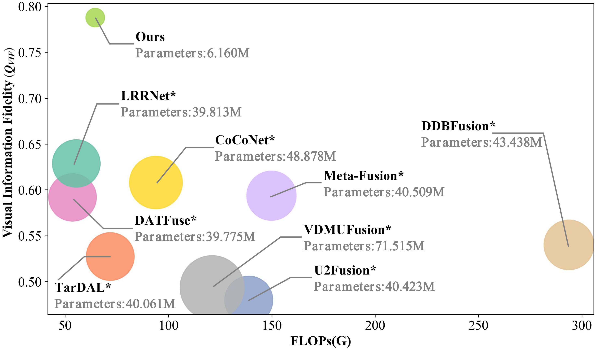
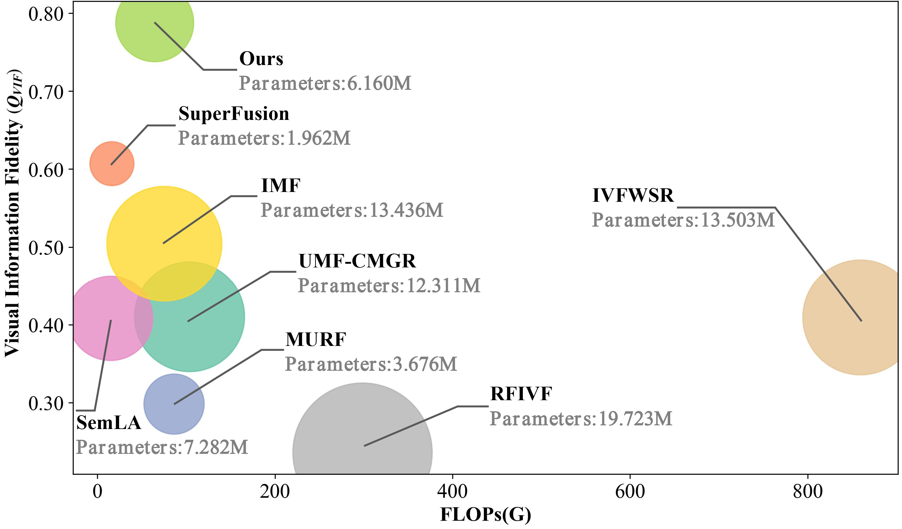

# Joint Multi-View Embedding with Progressive Multi-Scale Alignment for Unaligned Infrared-Visible Image Fusion


[](https://ubuntu.com/)


<div style="background-color: #fff8c5; color: #000000; padding: 10px; border-left: 4px solid #f0ad4e; border-radius: 4px;">
  <strong>	Our paper is currently under peer review. We sincerely appreciate your interest and support. The README will be further improved after acceptance.</strong>
</div>

<br>

[README-Chinese](./README_CN.md) | [README-English](./README.md) 


## 1. Introduction
We propose an end-to-end infrared-visible image fusion network (ME-PMA) with feature-level registration, featuring:

- End-to-end registration and fusion for unaligned scenarios
- Progressive multi-scale feature alignment with multi-view embedding
- Superior performance across datasets with single model weights

### Network Architecture


Key Components:
- **Feature Encoder**: SFE, UIB_Block, and Restormer
- **MSPA**: Multi-Scale Progressive Alignment module
- **Feature Decoder**: FFCM fusion and FRRB reconstruction

### MSPA Module

- Restormer_Corr: Global feature extraction with local correlation
- UIB_CA: Channel attention for local features
- Reg_flow: Multi-view registration flow prediction

## 2. Environment Setup

### Base Configuration
```bash
git clone https://github.com/yidamyth/ME-PMA.git
cd ME-PMA

# Create conda environment
conda create -n ME-PMA python=3.9.18
conda activate ME-PMA

# Install PyTorch
pip install torch==1.12.1+cu113
pip install torchvision==0.13.1+cu113

# Install dependencies
pip install -r requirements.txt
```

## 3. Data Preparation
```
.
└── ./DataSet/IVIF/
    ├── M3FD
        ├── test
            ├── ir
            ├── ir_move
            └── vis
    ├── MSRS
        ├── test
            ├── ir
            ├── ir_move
            └── vis
    └── RoadScene
        ├── RoadS_test
        │   ├── ir
        │   ├── ir_move
        │   └── vis
        └── RoadS_train
            ├── ir
            └── vis
```

## 4. Testing

End-to-end feature-level registration and fusion results (input images from unaligned scenarios)
```bash
python test_phase2.py
# Save to: ./DataSet/IVIF/RoadScene/RoadS_test/Results/UnAligned/
```

Direct fusion results, without using the registration module (input images from aligned scenarios)
```bash
python test.py
# Save to: ./DataSet/IVIF/RoadScene/RoadS_test/Results/Aligned/
```

> You can switch datasets to get results from different datasets. The default is test_path['RoadScene'] or ['M3FD'] or ['MSRS']; the same model weights are used for all different dataset tests.

## 5. Training

### First Stage Training (Fusion Network)
```bash

# 1. Find python location
which python
# ouput: /home/yida/anaconda3/envs/ME-PMA/bin/python

# 2. Edit conda path
vim run.sh

# 3. Switch to your anaconda3 conda path
eval "$(/home/your_user_name_xxx/anaconda3/bin/conda shell.bash hook)"

# 4. Save vim

# 5. Run
sh ./run.sh

# 6. Check logs
tail -f ./Logs/nohup/2024-1119-1001_time.log

# 7. Run program in background, can exit terminal
# Model save path: ./Model/Parameters/24-1119-1001/

# 8. Exit program
control + z
```

### Second Stage Training (Registration Network)
```bash
# 1. Edit conda path
vim run_phase2.sh
eval "$(/home/your_user_name_xxx/anaconda3/bin/conda shell.bash hook)"

# Load first stage model path
phase2_model_id='24-1119-1001'
phase2_ModelPath='./Model/Parameters/24-1119-1001/RegImageFusModel-best.pth'
# Save vim

# 2. Run
sh ./run_phase2.sh

# 3. Check logs
tail -f ./Logs/nohup/2024-1119-1355_time.log

# 4. Exit program
control + z
```

## Experiment Results

### Registration + Fusion Comparison Visualization


### Joint Optimization Comparison Visualization


### Evaluation Metrics

### Fusion Evaluation Metrics
- $Q_{CE↓}$
- $Q_{MI↑}$
- $Q_{VIF↑}$
- $Q_{AB/F↑}$
- $Q_{CB↑}$
- $Q_{CV↓}$

You can get our detailed quantitative evaluation metrics, using the following example:
```python
python ./Util/metrics_fus.py
```

### Registration Evaluation Metrics
- $Q_{MI↑}$
- $Q_{MS-SSIM↑}$
- $Q_{NCC↑}$

You can get our detailed quantitative evaluation metrics, using the following example:
```python
python ./Util/metrics_reg.py
```

> For convenience, you can directly perform metric tests to get results from the paper. However, specific details will be further supplemented after acceptance of the paper;

> Note that the registration evaluation metrics are the average of the three datasets.

### Experiment Results Visualization


### Registration + Fusion Optimization Results



### 📊 Table 1: Quantitative Comparison of Registration + Fusion Methods  
*(Red bold = best, Orange bold = second-best)*  




### 🚗 RoadScene Dataset
| Method      | $Q_{MI}$ ↑ | $Q_{CE}$ ↓ | $Q_{VIF}$ ↑ | $Q_{AB/F}$ ↑ | $Q_{CB}$ ↑ | $Q_{CV}$ ↓ |
| ----------- | ---------- | ---------- | ----------- | ------------ | ---------- | ---------- |
| Meta-Fusion | <span style="color:orange; font-weight:bold">3.1598</span> | <span style="color:orange; font-weight:bold">0.7210</span> | 0.5931 | 0.2711 | 0.3417 | 1304.8995 |
| TarDAL      | 2.5729 | 0.8588 | 0.5273 | 0.2098 | 0.3503 | 2309.3965 |
| U2Fusion    | 2.2014 | 1.0187 | 0.4798 | 0.2817 | 0.4266 | 1776.3013 |
| DATFuse     | 3.1237 | 0.8039 | 0.5918 | <span style="color:orange; font-weight:bold">0.3386</span> | 0.4283 | <span style="color:orange; font-weight:bold">864.8960</span> |
| LRRNet      | 2.6209 | 1.4728 | <span style="color:orange; font-weight:bold">0.6288</span> | 0.3230 | <span style="color:orange; font-weight:bold">0.4731</span> | 913.1348 |
| CoCoNet     | 2.3097 | 0.9942 | 0.6080 | 0.2634 | 0.4574 | 1635.9103 |
| DDBFusion   | 2.2559 | 1.1727 | 0.5400 | 0.2698 | 0.3908 | 1252.3511 |
| VDMUFusion  | 2.2052 | 0.8059 | 0.4935 | 0.2298 | 0.3802 | 1551.4407 |
| **Ours**    | <span style="color:red; font-weight:bold">4.3598</span> | <span style="color:red; font-weight:bold">0.4122</span> | <span style="color:red; font-weight:bold">0.7877</span> | <span style="color:red; font-weight:bold">0.3979</span> | <span style="color:red; font-weight:bold">0.4857</span> | <span style="color:red; font-weight:bold">636.7558</span> |


### 🏍️ M3FD Dataset
| Method      | $Q_{MI}$ ↑ | $Q_{CE}$ ↓ | $Q_{VIF}$ ↑ | $Q_{AB/F}$ ↑ | $Q_{CB}$ ↑ | $Q_{CV}$ ↓ |
| ----------- | ---------- | ---------- | ----------- | ------------ | ---------- | ---------- |
| Meta-Fusion | 3.0173 | 1.1911 | 0.5904 | 0.2818 | 0.4123 | 1326.7568 |
| TarDAL      | 2.9566 | 1.0932 | 0.5670 | 0.2068 | 0.3979 | 1532.9253 |
| U2Fusion    | 2.5369 | <span style="color:orange; font-weight:bold">1.0638</span> | 0.5965 | 0.4172 | <span style="color:red; font-weight:bold">0.4640</span> | 1115.3704 |
| DATFuse     | <span style="color:orange; font-weight:bold">3.3914</span> | 1.6030 | 0.6490 | 0.4032 | 0.4245 | 804.6190 |
| LRRNet      | 2.5597 | 1.5662 | 0.6672 | <span style="color:orange; font-weight:bold">0.4503</span> | <span style="color:orange; font-weight:bold">0.4472</span> | <span style="color:orange; font-weight:bold">782.3767</span> |
| CoCoNet     | 2.5524 | 1.1676 | <span style="color:orange; font-weight:bold">0.7961</span> | 0.3352 | 0.4115 | 1530.3093 |
| DDBFusion   | 2.4250 | 1.3975 | 0.5511 | 0.3461 | 0.4015 | 982.0145 |
| VDMUFusion  | 2.5092 | 1.4986 | 0.5172 | 0.2825 | 0.4114 | 984.2836 |
| **Ours**    | <span style="color:red; font-weight:bold">4.1585</span> | <span style="color:red; font-weight:bold">0.8221</span> | <span style="color:red; font-weight:bold">0.8083</span> | <span style="color:red; font-weight:bold">0.4641</span> | 0.4426 | <span style="color:red; font-weight:bold">766.2438</span> |


### 🌆 MSRS Dataset
| Method      | $Q_{MI}$ ↑ | $Q_{CE}$ ↓ | $Q_{VIF}$ ↑ | $Q_{AB/F}$ ↑ | $Q_{CB}$ ↑ | $Q_{CV}$ ↓ |
| ----------- | ---------- | ---------- | ----------- | ------------ | ---------- | ---------- |
| Meta-Fusion | 2.0020 | 2.1508 | 0.3831 | 0.2214 | 0.3855 | 818.3882 |
| TarDAL      | 2.0618 | 1.5758 | 0.4386 | 0.1357 | 0.4168 | 2474.7432 |
| U2Fusion    | 1.9934 | 1.1261 | 0.5081 | 0.3929 | 0.4770 | 969.1622 |
| DATFuse     | <span style="color:orange; font-weight:bold">3.5697</span> | 1.8426 | <span style="color:orange; font-weight:bold">0.7890</span> | <span style="color:orange; font-weight:bold">0.5438</span> | <span style="color:orange; font-weight:bold">0.5004</span> | <span style="color:orange; font-weight:bold">555.2225</span> |
| LRRNet      | 2.9645 | 2.5844 | 0.6438 | 0.4699 | 0.4360 | 694.7701 |
| CoCoNet     | 2.3879 | 2.5679 | 0.6974 | 0.3364 | 0.4616 | 1097.5978 |
| DDBFusion   | 2.1452 | <span style="color:orange; font-weight:bold">1.0623</span> | 0.5559 | 0.3118 | 0.4754 | 901.0095 |
| VDMUFusion  | 2.4895 | 1.1072 | 0.6095 | 0.2891 | 0.4799 | 854.6607 |
| **Ours**    | <span style="color:red; font-weight:bold">4.2775</span> | <span style="color:red; font-weight:bold">0.5673</span> | <span style="color:red; font-weight:bold">0.8594</span> | <span style="color:red; font-weight:bold">0.5742</span> | <span style="color:red; font-weight:bold">0.5226</span> | <span style="color:red; font-weight:bold">466.9209</span> |


📌 *Note: In each column, values in **red bold** are the best, and values in **orange bold** are the second-best. Color highlighting may not display on GitHub but works in local Markdown editors.*


---


### Joint Optimization Results


### 📊 Table 2: Quantitative Comparison of Joint Optimization Methods  
*(Red bold = best, Orange bold = second-best)*  




### 🚗 RoadScene Dataset
| Method        | $Q_{MI}$ ↑ | $Q_{CE}$ ↓ | $Q_{VIF}$ ↑ | $Q_{AB/F}$ ↑ | $Q_{CB}$ ↑ | $Q_{CV}$ ↓ |
| ------------- | ---------- | ---------- | ----------- | ------------ | ---------- | ---------- |
| UMF-CMGR      | 2.0545 | 0.6979 | 0.4103 | 0.2118 | 0.3604 | 2090.1031 |
| SuperFusion   | <span style="color:orange; font-weight:bold">2.8808</span> | 1.0122 | <span style="color:orange; font-weight:bold">0.6070</span> | <span style="color:orange; font-weight:bold">0.3385</span> | 0.4000 | <span style="color:orange; font-weight:bold">736.4983</span> |
| MURF          | 1.5161 | 1.3275 | 0.2981 | 0.2716 | 0.3873 | 1537.4943 |
| SemLA         | 2.0849 | 1.1658 | 0.4083 | 0.2145 | 0.2783 | 2245.0144 |
| RFIVF         | 1.7874 | 0.8726 | 0.2359 | 0.1355 | 0.3749 | 2321.7069 |
| IMF           | 2.3733 | 0.7157 | 0.5042 | 0.2620 | 0.3986 | 1297.7976 |
| IVFWSR        | 1.9872 | <span style="color:orange; font-weight:bold">0.5890</span> | 0.4095 | 0.2306 | 0.3894 | 1647.9761 |
| **Ours**      | <span style="color:red; font-weight:bold">4.3598</span> | <span style="color:red; font-weight:bold">0.4122</span> | <span style="color:red; font-weight:bold">0.7877</span> | <span style="color:red; font-weight:bold">0.3979</span> | <span style="color:red; font-weight:bold">0.4857</span> | <span style="color:red; font-weight:bold">636.7558</span> |


### 🏍️ M3FD Dataset
| Method        | $Q_{MI}$ ↑ | $Q_{CE}$ ↓ | $Q_{VIF}$ ↑ | $Q_{AB/F}$ ↑ | $Q_{CB}$ ↑ | $Q_{CV}$ ↓ |
| ------------- | ---------- | ---------- | ----------- | ------------ | ---------- | ---------- |
| UMF-CMGR      | 2.4425 | 1.2821 | 0.4351 | 0.1894 | 0.3909 | 1640.6968 |
| SuperFusion   | <span style="color:orange; font-weight:bold">2.9868</span> | 1.3335 | 0.5982 | <span style="color:orange; font-weight:bold">0.4098</span> | 0.4199 | <span style="color:orange; font-weight:bold">885.7659</span>  |
| MURF          | 2.3557 | 1.3906 | 0.5393 | 0.3821 | <span style="color:orange; font-weight:bold">0.4251</span> | 1295.2825 |
| SemLA         | 2.5120 | 1.4842 | 0.5268 | 0.2949 | 0.3613 | 1521.0582 |
| RFIVF         | 1.9926 | <span style="color:orange; font-weight:bold">1.1140</span> | 0.4355 | 0.1939 | 0.4191 | 1608.0113 |
| IMF           | 2.5745 | 1.3291 | 0.5360 | 0.2602 | 0.4301 | 900.7963 |
| IVFWSR        | 2.2129 | 1.1828 | 0.4608 | 0.2375 | 0.4354 | 1424.2831|
| **Ours**      | <span style="color:red; font-weight:bold">4.1585</span> | <span style="color:red; font-weight:bold">0.8221</span> | <span style="color:red; font-weight:bold">0.8083</span> | <span style="color:red; font-weight:bold">0.4641</span> | <span style="color:red; font-weight:bold">0.4426</span> | <span style="color:red; font-weight:bold">766.2438</span> |


### 🌆 MSRS Dataset
| Method        | $Q_{MI}$ ↑ | $Q_{CE}$ ↓ | $Q_{VIF}$ ↑ | $Q_{AB/F}$ ↑ | $Q_{CB}$ ↑ | $Q_{CV}$ ↓ |
| ------------- | ---------- | ---------- | ----------- | ------------ | ---------- | ---------- |
| UMF-CMGR      | 1.8601 | 2.3082 | 0.3749 | 0.1881 | 0.3797 | 1351.6438 |
| SuperFusion   | <span style="color:orange; font-weight:bold">2.5990</span> | 1.8040 | 0.5599 | 0.3807 | 0.4285 | <span style="color:orange; font-weight:bold">666.8654</span> |
| MURF          | 2.5051 | 1.7401 | <span style="color:orange; font-weight:bold">0.6658| <span style="color:orange; font-weight:bold">0.4578</span> | <span style="color:orange; font-weight:bold">0.4871</span> | 986.7504 |
| SemLA         | 2.4467 | 1.6006| 0.5975 | 0.3265 | 0.4326 | 1230.6355 |
| RFIVF         | 1.3331 | 0.8183| 0.3786 | 0.1586 | 0.3265 | 2168.4381 |
| IMF           | 2.1115 | 1.6757 | 0.5201 | 0.2755 | 0.4488 | 783.3043 |
| IVFWSR        | 2.2742 | <span style="color:red; font-weight:bold">0.4942</span> | 0.4793 | 0.2242 | 0.4520 | 862.8701 |
| **Ours**      | <span style="color:red; font-weight:bold">4.2775</span> | <span style="color:orange; font-weight:bold">0.5673</span> | <span style="color:red; font-weight:bold">0.8594</span> | <span style="color:red; font-weight:bold">0.5742</span> | <span style="color:red; font-weight:bold">0.5226</span> | <span style="color:red; font-weight:bold">466.9209</span> |


📌 *Note: In each column, values in **red bold** are the best, and values in **orange bold** are the second-best. Color highlighting may not display on GitHub but works in local Markdown editors.*

---


### Only Registration Performance Comparison Results


### Parameter Analysis: Registration + Fusion


### Parameter Analysis: Joint Optimization


### Model: Parameter Quantity + Calculation
```python
cd ./ME-PMA
python -m Model.Architecture.RegImageFusModel
```


## Citation
If you use this project's code, please cite our paper:
```
@article{xxx_2025_ME-PMA,
  title={Joint Multi-View Embedding with Progressive Multi-Scale Alignment for Unaligned Infrared-Visible Image Fusion},
  author={xxx},
  journal={xxx},
  volume={xx},
  number={x},
  pages={x--x},
  year={2025}
}
```

## License
This project uses the MIT License. See [LICENSE](LICENSE) file.


## Contact
Thank you for your review and attention. If you have any questions, please contact us by email: yida_myth@163.com (We will further improve the project after acceptance to provide help for you)


## Star History

<div style="text-align: center;">
<picture>
  <source
    media="(prefers-color-scheme: dark)"
    srcset="
      https://api.star-history.com/svg?repos=yidamyth/ME-PMA&type=Date&theme=dark
    "
  />
  <source
    media="(prefers-color-scheme: light)"
    srcset="
      https://api.star-history.com/svg?repos=yidamyth/ME-PMA&type=Date
    "
  />
  
</picture>
</div>