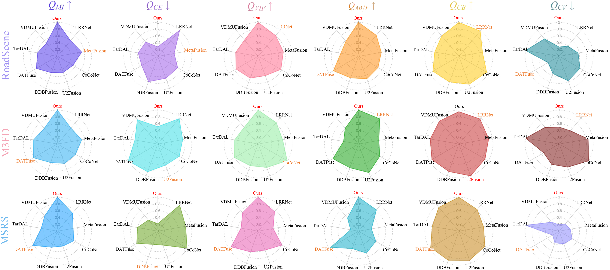
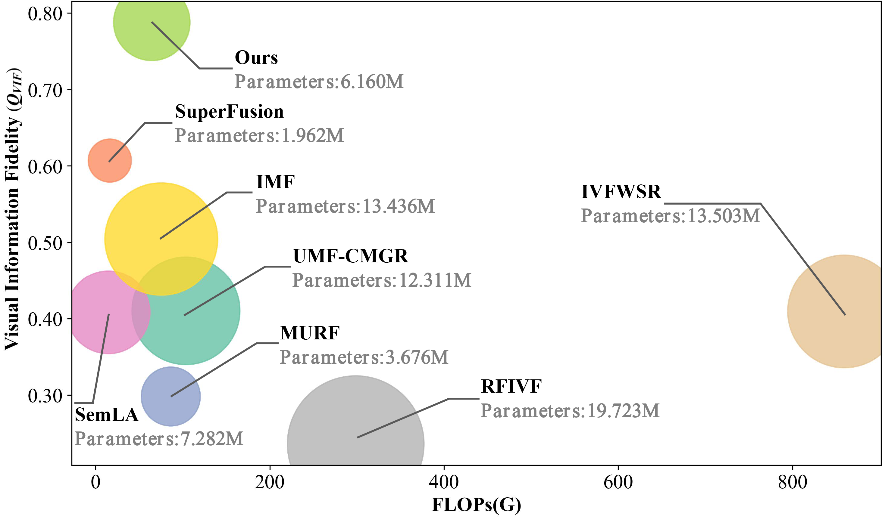

# Joint Multi-View Embedding with Progressive Multi-Scale Alignment for Unaligned Infrared-Visible Image Fusion


[](https://ubuntu.com/)


<div style="background-color: #fff8c5; color: #000000; padding: 10px; border-left: 4px solid #f0ad4e; border-radius: 4px;">
  <strong>我们的论文正在投稿接受同行评审中，感谢您的关注与支持，论文将在接收后进一步完善README文档。</strong>
</div>

<br>

[README-Chinese](./README_CN.md) | [README-English](./README.md) 


## 1. 简介
本方法提出了一个基于特征级配准的端对端红外与可见光图像融合网络(ME-PMA)。该网络可以同时处理图像配准和融合任务，主要包含以下创新点:
- 未对齐场景下端对端的实现红外与可见光图像配准与融合任务
- 提出一种多视角嵌入与渐进式多尺度特征对齐策略，可从多个视角生成泛化的变形场，实现特征级的配准。
- 所提方法在多个数据集上表现出优异的融合性能，同时具有较低的模型复杂度与计算成本，且仅使用一组模型权重。

### 网络结构，如下图所示


网络主要由以下部分组成:
- Feature Encoder: 特征编码器，包含SFE、UIB_Block和Restormer
- MSPA: 多尺度渐进式对齐模块，用于特征级配准
- Feature Decoder: 特征解码器，FFCM特征融合，FRRB用于重建输出最终融合结果

### 特征级配准模块MSPA，如下图所示


- Restormer_Corr: 局部相关性全局特征提取模块
- UIB_CA: 通道注意力局部特征提取模块  
- Reg_flow: 多视角配准流预测模块

## 2. 环境配置

### 基础环境
```bash
git clone https://github.com/yidamyth/ME-PMA.git
cd ME-PMA

# 创建conda环境
conda create -n ME-PMA python=3.9.18
conda activate ME-PMA

# 安装PyTorch
pip install torch==1.12.1+cu113
pip install torchvision==0.13.1+cu113

# 安装依赖
pip install -r requirements.txt
```

## 3. 数据准备
```
.
└── ./DataSet/IVIF/
    ├── M3FD
        ├── test
            ├── ir
            ├── ir_move
            └── vis
    ├── MSRS
        ├── test
            ├── ir
            ├── ir_move
            └── vis
    └── RoadScene
        ├── RoadS_test
        │   ├── ir
        │   ├── ir_move
        │   └── vis
        └── RoadS_train
            ├── ir
            └── vis
```

## 4. 测试

端对端特征级配准与融合结果（输入未对齐场景下的图像对）
```bash
python test_phase2.py
# Save to: ./DataSet/IVIF/RoadScene/RoadS_test/Results/UnAligned/
```

直接融合结果，不采用配准模块（输入对齐场景下的图像对）
```bash
python test.py
# Save to: ./DataSet/IVIF/RoadScene/RoadS_test/Results/Aligned/
```

> 能够切换数据集来获得不同数据集的结果，default=test_path['RoadScene'] or ['M3FD'] or ['MSRS']；不同数据测试均是用的相同模型权重参数。

## 5. 训练

### 第一阶段训练 (融合网络)
```bash

# 1.查找python位置
which python
# ouput: /home/yida/anaconda3/envs/ME-PMA/bin/python

# 2.编辑conda路径
vim run.sh

# 3.切换到你anaconda3下面的conda路径
eval "$(/home/your_user_name_xxx/anaconda3/bin/conda shell.bash hook)"

# 4.保存vim

# 5.运行
sh ./run.sh

# 6.查看日志
tail -f ./Logs/nohup/2024-1119-1001_time.log

# 7.将程序在后台自动运行，可退出终端
# 模型保存路径：./Model/Parameters/24-1119-1001/

# 8.退出程序
control + z
```

### 第二阶段训练 (配准网络)
```bash
# 1.编辑conda路径
vim run_phase2.sh
eval "$(/home/your_user_name_xxx/anaconda3/bin/conda shell.bash hook)"

# 加载第一阶段模型路径
phase2_model_id='24-1119-1001'
phase2_ModelPath='./Model/Parameters/24-1119-1001/RegImageFusModel-best.pth'
# 保存vim

# 2.运行
sh ./run_phase2.sh

# 3.查看日志
tail -f ./Logs/nohup/2024-1119-1355_time.log

# 4.退出程序
control + z
```

## 实验结果

### 配准+融合对比可视化


### 联合优化对比可视化


### 评估指标

### 融合评估指标
- $Q_{CE↓}$
- $Q_{MI↑}$
- $Q_{VIF↑}$
- $Q_{AB/F↑}$
- $Q_{CB↑}$
- $Q_{CV↓}$

读者能够获得我们详细的定量评估指标，使用示例如下:
```python
python ./Util/metrics_fus.py
```

### 配准评估指标
- $Q_{MI↑}$
- $Q_{MS-SSIM↑}$
- $Q_{NCC↑}$

读者能够获得我们详细的定量评估指标，使用示例如下:
```python
python ./Util/metrics_reg.py
```

> 为了方便读者使用，可直接进行指标测试，得到论文中的结果。但，具体细节我们将在论文接受后进一步补充；

> 值得注意的是配准评估指标是三个数据集总和的均值。

### 实验结果可视化


### 配准+融合优化结果


### 联合优化结果


### 仅对比配准性能的比较结果


### 参数分析：配准+融合


### 参数分析：联合优化


### 模型：参数量+计算量
```python
cd ./ME-PMA
python -m Model.Architecture.RegImageFusModel
```


## 引用
如果您使用了本项目的代码,请引用我们的论文:
```
@article{xxx_2025_ME-PMA,
  title={Joint Multi-View Embedding with Progressive Multi-Scale Alignment for Unaligned Infrared-Visible Image Fusion},
  author={xxx},
  journal={xxx},
  volume={xx},
  number={x},
  pages={x--x},
  year={2025}
}
```

## 许可证
本项目采用 MIT 许可证。详见 [LICENSE](LICENSE) 文件。


## 联系
感谢您的评审以及关注，如遇任何问题请联系我们邮箱：yida_myth@163.com（评审完成后会进一步完善项目，为各位读者提供帮助）


## Star History

<div style="text-align: center;">
<picture>
  <source
    media="(prefers-color-scheme: dark)"
    srcset="
      https://api.star-history.com/svg?repos=yidamyth/ME-PMA&type=Date&theme=dark
    "
  />
  <source
    media="(prefers-color-scheme: light)"
    srcset="
      https://api.star-history.com/svg?repos=yidamyth/ME-PMA&type=Date
    "
  />
  
</picture>
</div>